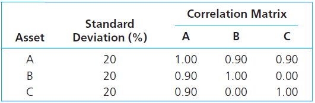

```{r load_packs}
pacman::p_load(tidyverse,tidyquant,FFdownload,PortfolioAnalytics,tsibble,matrixcalc,Matrix,timetk)
```

**Please** remember to put your assignment solutions in `rmd` format using **many** chunks and putting readable text in between, similar to my examples given in Research Methods and Assignment 1! Also, each student has to select his own set of 10 stocks having data available as of `2000-01-01`. Select by Sharpe-ratio, dominance or any other method (e.g. matching your first name).

## Exercise 1: Optimzing portfolios

Take your personal dataset of 10 stocks, set the time-frame to January 2000/ August 2018 (use a year-month format - either `as.yearmon` from `zoo` or `yearmonth` from `tsibble`) and calculate monthly simple returns (if you have not done so yet)! Use `pivot_wider()` and `tk_xts()` to make a `xts` (timeseries) from it (having ten columns with simple returns calculated from adjusted prices).
```{r, echo=FALSE, include=FALSE}
nyse <- tq_exchange("NYSE")
nasdaq <- tq_exchange("NASDAQ")
sp500 <- tq_index("SP500")
```

```{r}
stock.selection <- sp500 %>% 
  inner_join(rbind(nyse,nasdaq) %>% select(symbol, last.sale.price, market.cap, ipo.year),by=c("symbol")) %>% 
  dplyr::filter(ipo.year<2000&!is.na(market.cap)) %>% 
  arrange(desc(weight)) %>% 
  slice(1:10);stock.selection

stock.prices <- stock.selection$symbol %>% 
  tq_get(get="stock.prices", from = "2000-01-01", to = "2018-08-31") %>% 
  dplyr::group_by(symbol)

stock.returns <- stock.prices %>% 
                  tq_transmute(select = adjusted,
                               mutate_fun = periodReturn,
                               period="monthly", 
                               type="arithmetic") %>% 
                  ungroup()# %>% mutate(date=as.yearmon(date))
```

```{r}
xts.returns.wide <- stock.returns %>% pivot_wider(.,names_from=symbol, values_from=monthly.returns) %>% tk_xts(silent = TRUE); round(xts.returns.wide[1:20,],digits = 5)
```

a)  As off now, we always perform the following steps before doing anything portfolio related: Check the summary/basic statistics and moments of the assets. Plot and check for (multivariate) normality (OPTIONAL). Check the correlations and do a scatterplot. Check the covariance/correlation structure.

### Basic Statistics:
```{r}
basicStats(xts.returns.wide)
```
### QQ-Plots to check for normality
```{r}
ggplot(stock.returns,
  aes(sample=monthly.returns, color=symbol))+
  stat_qq()+
  stat_qq_line(
  mapping = NULL,
  data = NULL,
  geom = "path",
  position = "identity",
  distribution = stats::qnorm,
  dparams = list(),
  line.p = c(0.25, 0.75),
  fullrange = FALSE,
  na.rm = FALSE,
  show.legend = NA,
  inherit.aes = TRUE)+
  facet_wrap(~symbol)
```
### Scatterplot & Correlations
```{r}
chart.Correlation(xts.returns.wide, histogram=TRUE, pch=19)
```
b)  Plot the average return of the assets against their standard deviation. Are there any dominated assets? Plot the efficient frontier using `chart.EfficientFrontier` and `chart.EF.Weights` (also check the `demo(demo_efficient_frontier)` from the `portfolioAnalytics`-package.
### Average Returns vs. Standard Deviation
```{r}
stock.returns %>% 
  dplyr::group_by(symbol) %>% 
  dplyr::mutate(mean=mean(monthly.returns)) %>% 
  dplyr::mutate(sd=sd(monthly.returns)) %>% 
  ggplot(.,
  aes(x=sd,y=mean, color=symbol))+
  geom_point()+
  theme(axis.text.x = element_text(angle=90))+
  labs(x="Standard Deviation",
    y="Average Return")
```
At a first glance, AAPL seems to dominate all other assets while QCOM is dominated by all other assets.

### Efficient Frontier & Efficient Weights
```{r warning=FALSE}
stocks <- colnames(xts.returns.wide)
init <- portfolio.spec(assets=stocks)
init <- add.constraint(portfolio=init, type="box", min=0.05, max=0.4)

meanvar.portf <- add.objective(portfolio=init, type="risk", name="var", risk_aversion=10)
meanvar.portf <- add.objective(portfolio=meanvar.portf, type="return", name="mean")
meanvar.ef <- create.EfficientFrontier(R=xts.returns.wide, portfolio=init, type="mean-StdDev")
meanvar.ef
```
```{r}
chart.EfficientFrontier(meanvar.ef, match.col="StdDev", type="l", RAR.text="Sharpe Ratio", pch=4)
```

```{r}
chart.EF.Weights(meanvar.ef, colorset=rainbow12equal, match.col="StdDev")
```

c)	Now comes the fun: Work through the vignette of the `portfolioAnalytics`-package
(`vignette("portfolio_vignette")`), set a full investment constraint and limit the portfolio weights to be 'long only' and calculate minimum-variance/maximum-return and quadratic utility portfolios.</p> Add the investment constraints (i.e no short-selling and no leverage).
### Minimum-Variance
```{r}
stocks2 <- colnames(xts.returns.wide)
init2 <- portfolio.spec(assets=stocks2)

init2 <- add.constraint(portfolio=init2, type="weight_sum", min_sum=1, max_sum=1)
init2 <- add.constraint(portfolio=init2, type="box", min=0.05, max=0.4)


minvar.portf <- add.objective(portfolio=init2, type="risk", name="var")
minvar.opt <- optimize.portfolio(R=xts.returns.wide, portfolio=minvar.portf, optimize_method="ROI", trace=TRUE)
print(minvar.opt)
```

```{r}
 plot(minvar.opt, risk.col="StdDev", return.col="mean", main="Minimum Variance Optimization", chart.assets=TRUE,xlim=c(0, 0.2), ylim=c(0,0.05))
```
### Maximum-Return
```{r}
stocks3 <- colnames(xts.returns.wide)
init3 <- portfolio.spec(assets=stocks3)

init3 <- add.constraint(portfolio=init3, type="weight_sum", min_sum=1, max_sum=1)
init3 <- add.constraint(portfolio=init3, type="box", min=0.05, max=0.4)

maxret.portf <- add.objective(portfolio=init3, type="return", name="mean")
maxret.opt <- optimize.portfolio(R=xts.returns.wide, portfolio=maxret.portf, optimize_method="ROI", trace=TRUE)
print(maxret.opt)
```
```{r}
 plot(maxret.opt, risk.col="StdDev", return.col="mean", main="Maximum Return Optimization", chart.assets=TRUE,xlim=c(0, 0.2), ylim=c(0,0.05))
```
### Quadratic Utility
```{r}
stocks4 <- colnames(xts.returns.wide)
init4 <- portfolio.spec(assets=stocks4)

init4 <- add.constraint(portfolio=init4, type="weight_sum", min_sum=0, max_sum=1)


qu.portf <- add.objective(portfolio=init4, type="return", name="mean")
qu.portf <- add.objective(portfolio=qu.portf, type="risk", name="var", risk_aversion=3)
qu.opt <- optimize.portfolio(R=xts.returns.wide, portfolio=qu.portf, optimize_method="ROI", trace=TRUE)
print(qu.opt)
```
```{r}
 plot(qu.opt, risk.col="StdDev", return.col="mean", main="Quadratic Utility Optimization", chart.assets=TRUE,xlim=c(0, 0.2), ylim=c(0,0.05))
```

```{r}
stocks.qu <- colnames(xts.returns.wide)
init.qu <- portfolio.spec(assets=stocks.qu)

init.qu <- add.constraint(portfolio=init.qu, type="box", min=0, max=1)
init.qu <- add.constraint(portfolio=init.qu, type="weight_sum", min_sum=0, max_sum=1)


qu.portf2 <- add.objective(portfolio=init.qu, type="return", name="mean")
qu.portf2 <- add.objective(portfolio=qu.portf2, type="risk", name="var", risk_aversion=3)
qu.opt2 <- optimize.portfolio(R=xts.returns.wide, portfolio=qu.portf2, optimize_method="ROI", trace=TRUE)
print(qu.opt2)
```
```{r}
plot(qu.opt2, risk.col="StdDev", return.col="mean", main="Quadratic Utility Optimization", chart.assets=TRUE,xlim=c(0, 0.2), ylim=c(0,0.05))
```


c)	Allow for short selling (delete the long only constraint). What happens to your portfolio? Illustrate using the efficient frontier! Combine efficient frontiers using `chart.EfficientFrontierOverlay` to highlight the differences.
```{r}
meanvar.portf2 <- add.constraint(portfolio=meanvar.portf, type="box", min=-0.2, max=0.4)
qu.portf <- add.constraint(portfolio=qu.portf, type="box", min=-0.2, max=0.4)

port.list <- combine.portfolios(list(meanvar.portf,meanvar.portf2, qu.portf))

chart.EfficientFrontierOverlay(R=xts.returns.wide,portfolio_list =port.list,type="mean-StdDev", match.col="StdDev", legend.loc="topleft", legend.labels=c("Mean-Variance", "Mean-Variance Short", "Quadratic Utility"), cex.legend=0.6, labels.assets=FALSE, pch.assets=1)
```
```{r}
port.list2 <- combine.portfolios(list(qu.portf, qu.portf2))

chart.EfficientFrontierOverlay(R=xts.returns.wide,portfolio_list =port.list2,type="mean-StdDev", match.col="StdDev", legend.loc="topleft", legend.labels=c("Quadratic Utility", "Quadratic Utility 2"), cex.legend=0.6, labels.assets=FALSE, pch.assets=1)
```

d)	Play around with the constraints and see what happens. Illustrate using `chart.EfficientFrontierOverlay`.
```{r}
meanvar.portf3 <- add.constraint(portfolio=meanvar.portf, type="box", min=0.09, max=0.2)
port.list3 <- combine.portfolios(list(meanvar.portf, meanvar.portf2, meanvar.portf3))

chart.EfficientFrontierOverlay(R=xts.returns.wide,portfolio_list =port.list3,type="mean-StdDev", match.col="StdDev", legend.loc="topleft", legend.labels=c("Mean-Variance", "Mean Variance Short", "Mean Variance Narrow Weights"), cex.legend=0.6, labels.assets=FALSE, pch.assets=1)
```


## Exercise 2: Do it yourself

In this exercise you first download the IBoxx Euro Corporate All Maturities ("IBCRPAL") and the EuroStoxx ("DJES50I") index from Datastream - monthly data as long as possible. We will check the calculations of `R`. Calculate discrete monthly returns.
```{r}
index.data <- index_data %>% pivot_longer(.,2:3,names_to="Index", values_to="Value") %>% dplyr::arrange(., Index, Date) %>% dplyr::select(Index, Date, Value) %>% dplyr::group_by(Index) %>% dplyr::filter(Date>="2003-05-01",Date<="2007-05-31")
index.returns <- index.data %>% 
                  tq_transmute(select = Value,
                               mutate_fun = periodReturn,
                               period="monthly", 
                               type="arithmetic") %>% 
                  ungroup() # %>% mutate(date=as.yearmon(date)) 

xts.index.wide <- index.returns %>% pivot_wider(.,names_from=Index, values_from=monthly.returns) %>% tk_xts(silent = TRUE); round(xts.index.wide[1:20,],digits = 5)
```
a)	Stats/Normality (see A1)
```{r}
basicStats(xts.index.wide)
```

```{r}
ggplot(index.returns,
  aes(sample=monthly.returns, color=Index))+
  stat_qq()+
  stat_qq_line(
  mapping = NULL,
  data = NULL,
  geom = "path",
  position = "identity",
  distribution = stats::qnorm,
  dparams = list(),
  line.p = c(0.25, 0.75),
  fullrange = FALSE,
  na.rm = FALSE,
  show.legend = NA,
  inherit.aes = TRUE)+
  facet_wrap(~Index)
```

```{r}
chart.Correlation(xts.index.wide, histogram=TRUE, pch=19)
```

b)	Get the necessary input parameters (mu, sigma, please using variables, I don't want to see manual numbers in your code) and calculate the Minimum-Variance-Portfolio (manually in R). Then do it using the `portfolioAnalytics`-package.
```{r}
mu.stoxx <- mean(xts.index.wide[,1])
mu.iboxx <- mean(xts.index.wide[,2])

sigma.stoxx <- sd(xts.index.wide[,1])
sigma.iboxx <- sd(xts.index.wide[,2])

corr.iboxx.stoxx <- cor(xts.index.wide[,1],xts.index.wide[,2])

w.stoxx.opt <- ((sigma.iboxx^2-sigma.stoxx*sigma.iboxx*corr.iboxx.stoxx)/(sigma.stoxx^2+sigma.iboxx^2-2*sigma.stoxx*sigma.iboxx*corr.iboxx.stoxx))
w.iboxx.opt <- 1-w.stoxx.opt
```
If we assume that the full-investment constraint is the only constraint we have, we would short `r round(w.stoxx.opt*100,2)`% of the Euro Stoxx 50 Index and go long in `r round(w.iboxx.opt*100,2)`%  of the Iboxx Euro Corporate Index. </p>
```{r}
indices <- colnames(xts.index.wide)
init5 <- portfolio.spec(assets=indices)

init5 <- add.constraint(portfolio=init5, type="weight_sum", min_sum=1, max_sum=1)


minvar.indices <- add.objective(portfolio=init5, type="risk", name="var")
minvar.opt <- optimize.portfolio(R=xts.index.wide, portfolio=minvar.indices, optimize_method="ROI", trace=TRUE)
print(minvar.opt)
```
When we use the `portfolioAnalytics`-package we can confirm the manually calculated results. </p>
c)	Now assume a risk-free rate of 0 and calculate the Tangency-Portfolio manually and with the `portfolioAnalytics`-package. What is the slope of the CAL? Plot a mu-sigma-diagram including all relevant information. What are your portfolio weights and weighted returns? Additionally allow for shortselling and check for changes.
```{r}
cov.stoxx.iboxx <- cov(xts.index.wide[,1],xts.index.wide[,2])

w.stoxx.tp <- (mu.stoxx*sigma.iboxx^2-mu.iboxx*cov.stoxx.iboxx)/(mu.stoxx*sigma.iboxx^2+mu.iboxx*sigma.stoxx^2-(mu.stoxx+mu.iboxx)*cov.stoxx.iboxx)
w.iboxx.tp <- 1-w.stoxx.tp
```
If we once more assume that the full-investment constraint is the only constraint we have, then we would short `r round(w.stoxx.tp*100,2)`% of the Euro Stoxx 50 Index and go long in `r round(w.iboxx.tp*100,2)`%  of the Iboxx Euro Corporate Index.</p>
```{r}
indices <- colnames(xts.index.wide)

init6 <- portfolio.spec(assets=indices)
init6 <- add.constraint(portfolio=init6, type="full_investment")
init6 <- add.constraint(portfolio=init6, type="box", min=-1, max=2)

meanvar.indices <- add.objective(portfolio=init6, type="risk", name="StdDev")
meanvar.indices <- add.objective(portfolio=meanvar.indices, type="return", name="mean")
meanvar.tp <- optimize.portfolio(R=xts.index.wide, portfolio=meanvar.indices, optimize_method="ROI", trace=TRUE, maxSR=TRUE)
print(meanvar.tp)
```
Again we can check the manually calculated results using the `portfolioAnalytics`-package. With a risk-aversion of 13.6 we get the same results. </p>
```{r}
mu.tp <- w.stoxx.tp*mu.stoxx+w.iboxx.tp*mu.iboxx
sd.tp <- (w.stoxx.tp^2*sigma.stoxx^2+w.iboxx.tp^2*sigma.iboxx^2+2*w.stoxx.tp*w.iboxx.tp*cov.stoxx.iboxx)
sd.tp <- sqrt(sd.tp)
CAL <- (mu.tp/sd.tp)
```
The weights of the tangency portfolio are as follows:

* EuroStoxx 50 Index : `r round(w.stoxx.tp*100,2)`%
* Iboxx Euro Corporate Index: `r round(w.iboxx.tp*100,2)`%

The expected portfolio return is `r round(mu.tp*100,2)`% and the standard deviation is `r round(sd.tp*100,2)`% resulting in a Sharpe ratio of `r round(CAL,2)` which is also the slope of the CAL.

```{r}
chart.EfficientFrontier(meanvar.tp, match.col="StdDev", type="l", RAR.text="Sharpe Ratio", pch=4)
```
As we already had no short-selling constraint for the previous portfolios nothing really changes. Introducing a short-selling constraint without any other constraint will result in an optimal portfolio that invests a 100% of its capital into the Iboxx Euro Corporate Index as can be seen below.
```{r}
init6 <- add.constraint(portfolio=init6, type="weight_sum", min_sum=1, max_sum=1)
init6 <- add.constraint(portfolio=init6, type="box", min=0, max=1)

meanvar.indices <- add.objective(portfolio=init6, type="risk", name="var", risk_aversion=13.6)
meanvar.indices <- add.objective(portfolio=meanvar.indices, type="return", name="mean")
meanvar.tp <- optimize.portfolio(R=xts.index.wide, portfolio=meanvar.indices, optimize_method="ROI", trace=TRUE)
print(meanvar.tp)
```

d)	Now, assume a risk-aversion of A=1, 2 or 3 and calculate your optimal complete portfolio (see lecture slides).
```{r}
rf <- 0.
A1 <- 1 
A2 <- 2
A3 <- 3

y.star.1 <- (mu.tp-rf)/(A1*sd.tp^2); drop(y.star.1)
y.star.2 <- (mu.tp-rf)/(A2*sd.tp^2); drop(y.star.2)
y.star.3 <- (mu.tp-rf)/(A3*sd.tp^2); drop(y.star.3)
```


## Exercise 3: Covariance Problems

In the first part of this exercise we will be checking covariances and portfolios that might occur from faulty correlation matrices. We use the covariance matrix from our example
```{r cov, echo=FALSE, fig.cap="Faulty covariance matrix", out.width = '60%'}

```
where we additionally assume mean returns of 10% for all three assets.
If we define $\mu$ to be the vector of mean returns and $\sigma$ the vector of standard deviations, we can calculate the covariance matrix $\Sigma$ as $\Sigma=diag(\sigma)\cdot R\cdot diag(\sigma)$, where $R$ is the correlation matrix (as in the table above) and $diag$ puts the three standard deviations into the diagonal of a matrix.
```{r}
mu <- as.vector(c(0.1,0.1,0.1))
sd <- as.vector(c(0.2,0.2,0.2))
cor.mat <- matrix(c(1,0.9,0.9,0.9,1,0,0.9,0,1),nrow=3,ncol=3)
cov.mat <- diag(sd,names=TRUE)%*%cor.mat%*%diag(sd,names=TRUE); cov.mat
```
Now we can calculate the Minimum-Variance-Portfolio using matrix calculus as
$w_MP=\frac{\Sigma^{-1}\cdot 1'}{1\cdot\Sigma^{-1}\cdot 1'}$
where 1 is a vector of ones with dimension equal to the number of assets. Similarly one can calculate the tangency portfolio as
$w_TP=\frac{\Sigma^{-1}\cdot (\mu-r_f)'}{1\cdot\Sigma^{-1}\cdot (\mu-r_f)'}$.

```{r}
is.positive.semi.definite(cov.mat)
ones <- as.vector(c(1,1,1))
ones <- t(ones)

mvp.faulty.up <- inv(cov.mat)%*%t(ones)
mvp.faulty.down <- ones%*%inv(cov.mat)%*%t(ones)
mvp.faulty <- mvp.faulty.up/drop(mvp.faulty.down)

mvp.faulty.mu <- mu%*%mvp.faulty
mvp.faulty.var <- t(mvp.faulty)%*%cov.mat%*%(mvp.faulty)

mvp.faulty.mu
mvp.faulty.var
```
```{r}
rf<- 0.02
tp.faulty.up <- inv(cov.mat)%*%(mu-rf)
tp.faulty.down <- ones%*%inv(cov.mat)%*%(mu-rf)
tp.faulty <- tp.faulty.up/drop(tp.faulty.down)

tp.faulty.mu <- mu%*%tp.faulty
tp.faulty.var <- t(tp.faulty)%*%cov.mat%*%(tp.faulty)

tp.faulty.mu
tp.faulty.var
```
In this case the MVP has the same mean and variance as the TP.
```{r}
w <- as.vector(c(-1,1,1))
w.mu <- mu%*%w
w.sd <- t(w)%*%cov.mat%*%w
```
If we use these weights and the faulty correlation matrix we get a negative variance for the portfolio.</p>

So to get used to the necessary tools, we use the package "matrixcalc" wherein we have a function `is.positive.semi.definite()` that can check covariance/correlation matrices for positive semidefiniteness. In the package `Matrix` we find a function `nearPD` that can help us to create a valid correlation matrix. Try and calculate the weights of the MVP and the TP, and then calculate portfolio mean and variance using $\mu_P=w\cdot \mu'$ and $\sigma_P^2=w\cdot \Sigma\cdot w'$ for the MVP and the TP as well as the weight vector w=(-1,1,1). Do this for the faulty matrix as well as the corrected one. What do you observe?
```{r}
is.positive.semi.definite(cov.mat)
```

```{r}
new.cor.mat <-nearPD(cor.mat, keepDiag=TRUE)
new.cov.mat <- diag(sd)%*%new.cor.mat$mat%*%diag(sd)
is.positive.semi.definite(inv.new.cov.mat)
```

```{r}
mvp.up <- inv(new.cov.mat)%*%t(ones)
mvp.down <- (ones%*%inv(new.cov.mat)%*%t(ones))
mvp <- mvp.up/drop(mvp.down)

mvp.mu <- mu%*%mvp
mvp.var <- t(mvp)%*%new.cov.mat%*%(mvp)

mvp.mu
mvp.var
```

```{r}
tp.up <- inv(new.cov.mat)%*%(mu-rf)
tp.down <- (ones%*%inv(new.cov.mat)%*%(mu-rf))
tp <- tp.up/drop(tp.down)

tp.mu <- mu%*%tp
tp.var <- t(tp)%*%new.cov.mat%*%(tp)

tp.mu
tp.var
```
